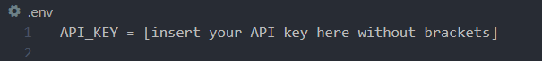

# Weather Comparison

#### Compare the weather for up to 4 locations. 

#### By _**Mekinsie Callahan, Glen Buck, Salim Mayan, Kerry Lang, Nick Lindau**_

## Technologies Used

* _CSS_
* _HTML5_
* _Bootstrap_
* _JavaScript_
* _jQuery_
* _Webpack_
* _npm_

## Description
This website provides you with the ability to compare the weather forecast in different locations. You can search up to four cities.

## Setup/Installation Requirements
Note: You need to have git and npm already installed to setup and install this project.

**Download the repo:**
1. Go to https://github.com/mekinsie/weather-project
2. Navigate to and click the green   button on middle upper right part of webpage.
3. Click on "Download ZIP"
4. Navigate to the downloaded zip and open it.
5. Open the folder inside the zip.
6. Follow steps 6-8 below.

Clone the repo:
1. Go to https://github.com/mekinsie/weather-project
2. Navigate to and click the green  button on middle upper right part of webpage.
3. Copy the HTTPs address to your clipboard.
4. Open terminal or bash and navigate to the directory you wish to download the repo to.
5. Once you have chosen your desired directory, open your terminal, type "git clone [paste link]" and press enter:
```bash 
$ git clone https://github.com/mekinsie/weather-project
```
6. To open the folder in your default code editor, navigate to the downloaded folder and type "code ." into your terminal:
``` bash
$ code .
```
7. Type "npm install" into the terminal to download the node modules folder and its corresponding dependencies. 
``` bash
$ npm install
```
8. While still in the root folder, create a .env file by typing "touch .env" in your terminal.
``` bash
$ touch .env
```
9. Continue to the steps below in "How to Get My Own API Keys"

**How to Get My Own API Keys (OpenCase Geocoding & OpenWeather)**
You will need to obtain two API keys for this project.

OpenWeather API Key:
1. Navigate to https://home.openweathermap.org/
2. Click on "Sign in" in the upper right hand corner in the navigation bar.
3. If you are new, click "Create an Account", fill out your information and click the orange "Create Account" button at the bottom of the form. If you already have an account, proceed to sign in. 
4. Hover over your username in the top right-hand corner and click on "My API Keys" in the dropdown menu. 
5. Here, copy the API key to your clipboard and paste it in the .env file that you created in this format: API_WEATHER_KEY=[paste API key here without brackets]. Make sure to keep this API key secure just like you would a password.<br>

6. Continue to get the OpenCage API key.

OpenCage API Key:
1. Navigate to https://opencagedata.com/
2. Click on "Documentation" in the navigation bar at the top and select "Quick Start".
3. Click "Sign up for your API key". Sign in with either GitHub, Google account, or with your email.
4. Click on "Dashboard" and select API keys.
5. Here, copy the API key to your clipboard and paste it in the .env file that you created in this format: API_OPENCAGE_KEY=[paste API key here without brackets]. Make sure to keep this API key secure just like you would a password.


6. Type "npm run start" into your terminal while still in the root folder. This will build a dist folder with a bundled js file and index.html and a live server will automatically open in your default browser.
``` bash
$ npm run start
```

## Known Bugs

* _No known bugs_

## License
_GPL_

Copyright (c) 2021 **_Mekinsie Callahan, Glen Buck, Salim Mayan, Kerry Lang, Nick Lindau_**

## Contact Information
<li> Reach Mekinsie: via <a href="https://www.linkedin.com/in/mekinsie/" target="_blank">Linkedin</a> or <a href="mailto:mekinsie.aja@gmail.com" target="_blank">Email</a>.
Checkout Mekinsie's <a href="https://github.com/mekinsie" target="_blank">GitHub profile</a>.</li>
<li>Reach Glen: via <a href="https://www.linkedin.com/in/glen-buck/" target="_blank">Linkedin</a> or <a href="mailto:glenbuck503@gmail.com" target="_blank">Email</a>. Checkout Glen's <a href="https://github.com/glenbuck503" target="_blank">GitHub profile</a>.</li>
<li> Reach Salim: via <a href="https://www.linkedin.com/in/salim-mayan/" target="_blank">Linkedin</a> or <a href="mailto:mailsalim@gmail.com" target="_blank">Email</a>.
Checkout Salim's <a href="https://github.com/Rekjal" target="_blank">GitHub profile</a>.</li>
<li>Reach Kerry: via <a href="https://www.linkedin.com/in/klang812/" target="_blank">LinkedIn</a> or <a href="mailto:klang812@gmail.com" target="_blank">Email</a>.
Checkout Kerry's <a href="https://github.com/klang812" target="_blank">GitHub profile</a></li>
<li>Reach Nick: via <a href="https://www.linkedin.com/in/[[link]]" target="_blank">LinkedIn</a> or <a href="[[email]]" target="_blank">Email</a>.
Checkout Nick's <a href="https://github.com/[[link]]" target="_blank">GitHub profile</a></li>


